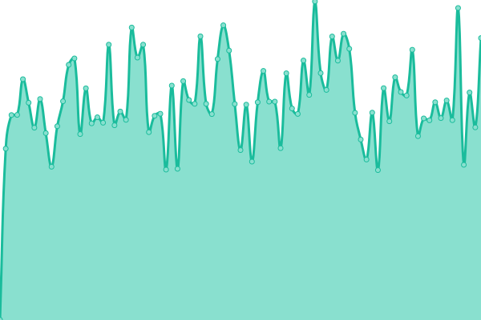
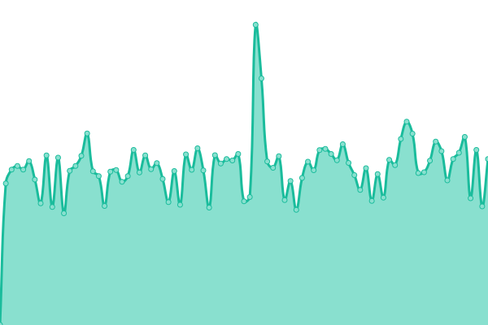

# [📈 Live Status](https://status.vflits.com): <!--live status--> **🟩 All systems operational**

This repository contains the open-source uptime monitor and status page for [Upptime](https://upptime.js.org), powered by [Upptime](https://github.com/upptime/upptime).

With [Upptime](https://upptime.js.org), you can get your own unlimited and free uptime monitor and status page, powered entirely by a GitHub repository. We use [Issues](https://github.com/upptime/upptime/issues) as incident reports, [Actions](https://github.com/Fluffy-Pan/upptime/actions) as uptime monitors, and [Pages](https://status.vflits.com) for the status page.

<!--start: status pages-->
<!-- This summary is generated by Upptime (https://github.com/upptime/upptime) -->
<!-- Do not edit this manually, your changes will be overwritten -->
<!-- prettier-ignore -->
| URL | Status | History | Response Time | Uptime |
| --- | ------ | ------- | ------------- | ------ |
|  [Unifi Controller](https://unifi.vflits.com/) | 🟩 Up | [unifi-controller.yml](https://github.com/Fluffy-Pan/upptime/commits/HEAD/history/unifi-controller.yml) | 

 1293ms
     
 | 

<a href="https://status.vflits.com/history/unifi-controller">99.84%</a>
    

|  [Portainer](https://portainer.wpang.net) | 🟩 Up | [portainer.yml](https://github.com/Fluffy-Pan/upptime/commits/HEAD/history/portainer.yml) | 

 727ms
     
 | 

<a href="https://status.vflits.com/history/portainer">100.00%</a>
    

|  [IMS](https://ims.vflits.com) | 🟩 Up | [ims.yml](https://github.com/Fluffy-Pan/upptime/commits/HEAD/history/ims.yml) | 

 1451ms
     
 | 

<a href="https://status.vflits.com/history/ims">99.84%</a>
    

<!--end: status pages-->

[**Visit our status website →**](https://status.vflits.com)

## 📄 License

- Powered by: [Upptime](https://github.com/upptime/upptime)
- Code: [MIT](./LICENSE) © [Upptime](https://upptime.js.org)
- Data in the `./history` directory: [Open Database License](https://opendatacommons.org/licenses/odbl/1-0/)
